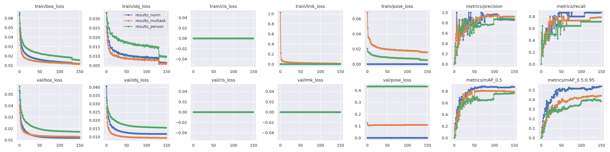
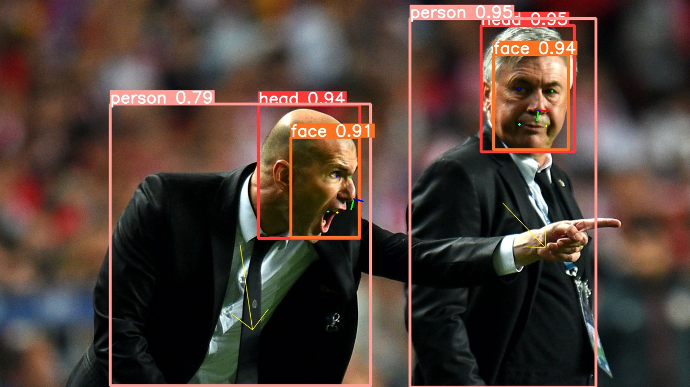
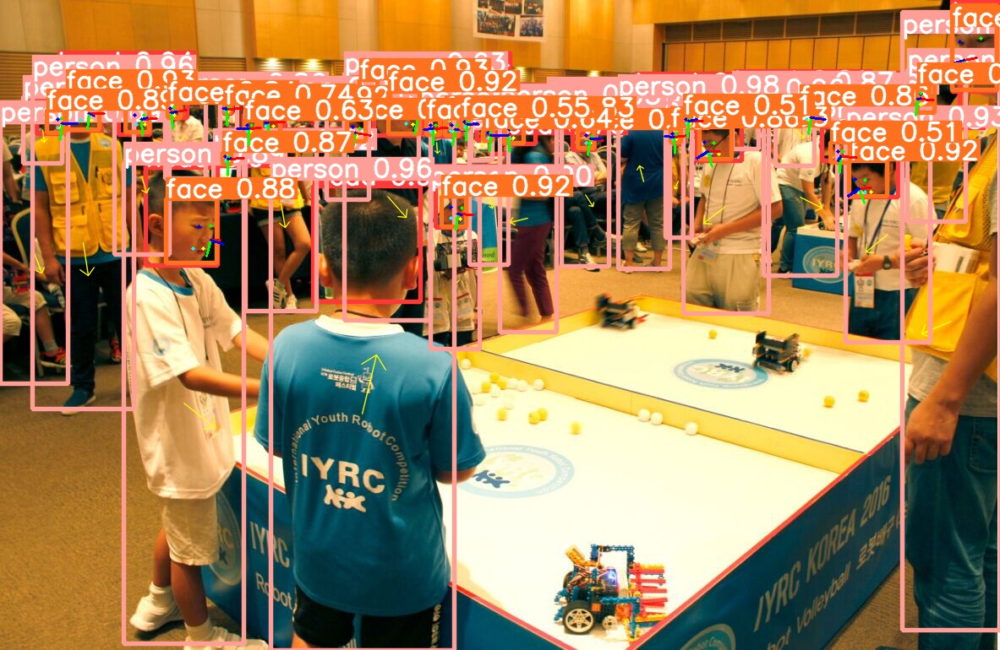

# YOLOMT

##
1.This is a multi-task model base yolo,detect human orientation,face pose and face landmark

<table>
<tr>
<th>train results</th>
<th>detect sample1</th>
  <th>detect sample2</th>
</tr>
<tr>
<td></td>
<td></td> 
<td></td> 
</tr>
</table>

2.More detection results can be seen in the. asset folder

<details>
<summary>demo</summary>

### 1.run

```bash
python detect.py --weights yolomt.onnx --source your_img.jpg  # image
```

### 2.pretrain weight
[[Baidu Drive](https://pan.baidu.com/s/16K9GPjfYBkiUVip2qUgeYA?pwd=7b4x)]

<details>
<details> 
<summary>Training</summary>

The commands below reproduce YOLOv5 [COCO](https://github.com/ultralytics/yolov5/blob/master/data/scripts/get_coco.sh)
results. [Models](https://github.com/ultralytics/yolov5/tree/master/models)
and [datasets](https://github.com/ultralytics/yolov5/tree/master/data) download automatically from the latest
YOLOv5 [release](https://github.com/ultralytics/yolov5/releases). Training times for YOLOv5n/s/m/l/x are
1/2/4/6/8 days on a V100 GPU ([Multi-GPU](https://github.com/ultralytics/yolov5/issues/475) times faster). Use the
largest `--batch-size` possible, or pass `--batch-size -1` for
YOLOv5 [AutoBatch](https://github.com/ultralytics/yolov5/pull/5092). Batch sizes shown for V100-16GB.

```bash
python train.py --data coco.yaml --cfg yolov5n.yaml --weights '' --batch-size 128
                                       yolov5s                                64
                                       yolov5m                                40
                                       yolov5l                                24
                                       yolov5x                                16
```


</details>
